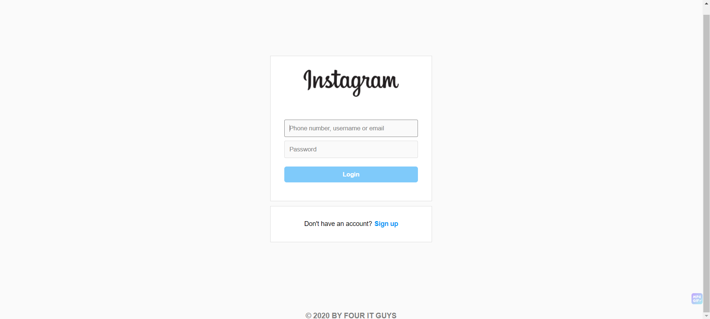
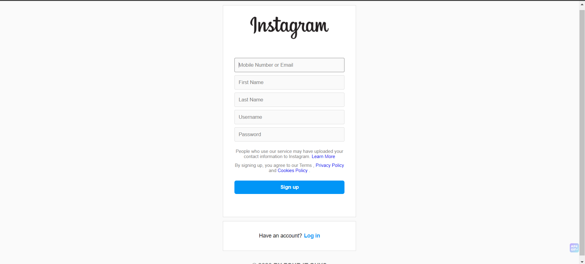
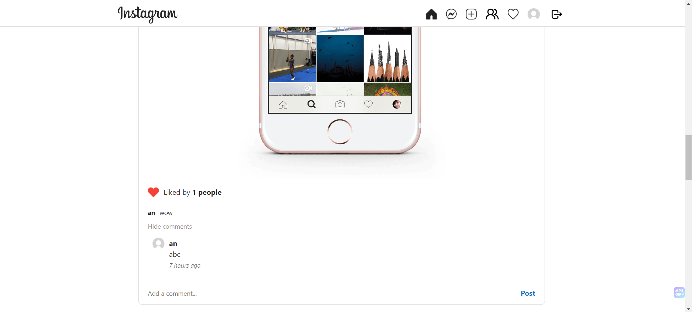
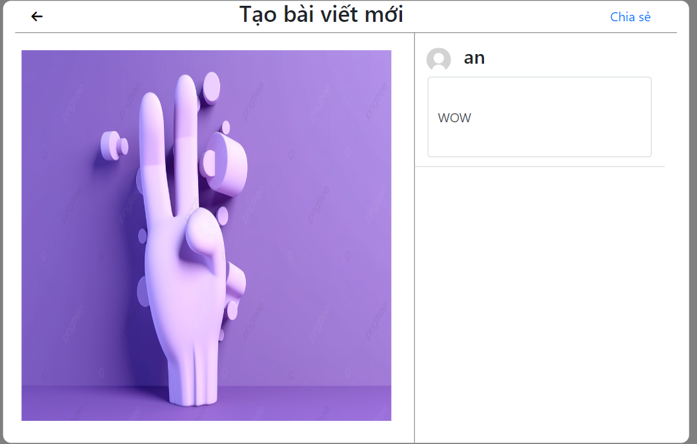
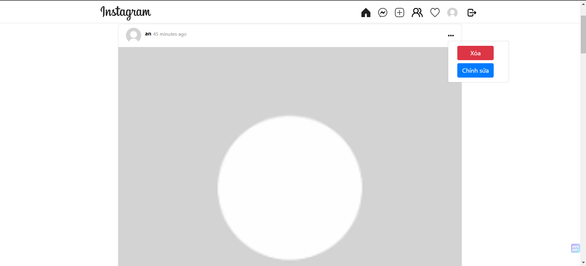
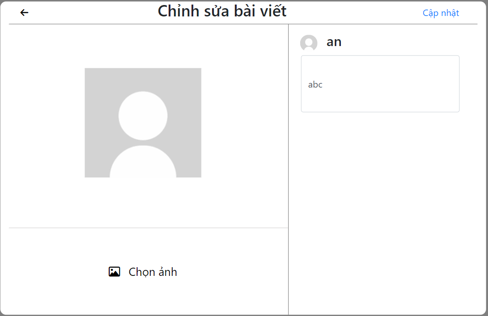
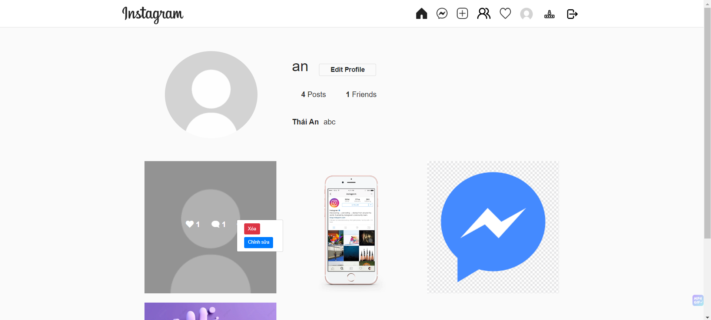
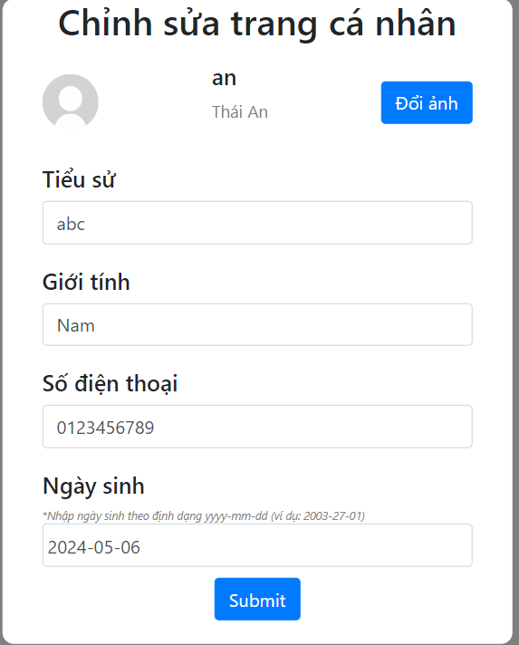
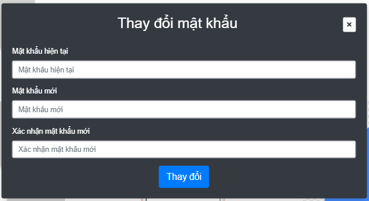
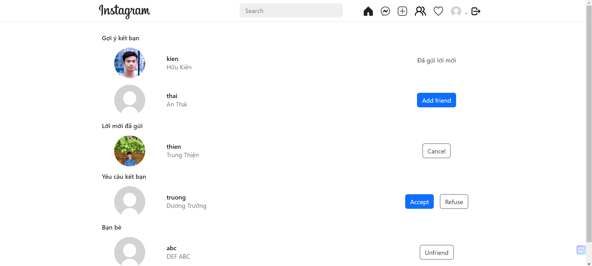

# Social Website
This is a social website built using Django, a high-level Python web framework,  inspired by Instagram. Users can connect, interact, share posts, and engage in discussions, fostering connections and sharing inspirations.

## Member
<div style="display: flex; justify-content: center;">
    <table border="1">
        <thead>
            <tr>
                <th style="text-align: center;">Order</th>
                <th style="text-align: center;">Student ID</th>
                <th style="text-align: center;">Full Name</th>
            </tr>
        </thead>
        <tbody>
            <tr>
                <td style="text-align: center;">1</td>
                <td style="text-align: center;">3121410046</td>
                <td><a href="https://an-hdt.github.io/AnHDT_portfolio/">Huỳnh Dương Thái An</a></td>
            </tr>
            <tr>
                <td style="text-align: center;">2</td>
                <td style="text-align: center;">3121560001</td>
                <td><a href="https://huukienit.github.io/HuuKien-Portfolio/">Ngũ Hữu Kiên</a></td>
            </tr>
            <tr>
                <td style="text-align: center;">3</td>
                <td style="text-align: center;">3121410470</td>
                <td><a href="https://thientranreal.github.io/thien-portfolio/">Trần Trung Thiện</a></td>
            </tr>
            <tr>
                <td style="text-align: center;">4</td>
                <td style="text-align: center;">3121410546</td>
                <td><a href="https://bt2701.github.io/My-Profile/">Dương Thành Trưởng</a></td>
            </tr>
        </tbody>
    </table>   
</div>

## Features
- User Authentication: Secure user registration and login system.
- Customizable Profiles: Users can personalize their profiles with relevant information and change passwords.
- Post Management: Easily create, edit, and delete posts.
- Commenting System: Interact with posts by leaving comments.
- Friendship Mechanism: Connect with other users to stay updated with their posts.
- News Feed: A personalized feed displaying posts from connected users.
- Search Functionality: Easily find users using the search feature.

## Interface
1. Login

2. Register

3. Home

4. Add post

5. Delete post 

6. Edit post

7. Profile

8. Edit profile 

9. Change password

10. Friends

11. Notifications

12. Messenger

13. Individual call

14. Group call
 

## Installation

### Linux
1. Install Python:
    ```shell
    sudo apt-get install python 
    ```
2. Install Django:
    ```shell
    pip install django 
    ```
3. Clone the repository:
    ```shell
    git clone https://github.com/thientranreal/InstagramProject.git
    ```
4. Navigate to the project directory:
    ```shell
    cd InstagramProject
    ```
5. Install the required dependencies:
    ```shell
    pip install -r requirements.txt
    ```
6. Set up the database:
    ```shell
    python manage.py migrate
    ```
7. Start the development server:
    ```shell
    python manage.py runserver
    ```
8. Access the website at `http://localhost:8000` in your web browser.

### Windows
1. Visit the [Python website](https://www.python.org/downloads/) to choose the appropriate version.
2. Run the .exe file to install Python.
3. Check the version: 
    ```shell
    python --version 
    ```
4. Install Django: 
    ```shell
    pip install django
    ```
5. Clone the repository:
    ```shell
    git clone https://github.com/thientranreal/InstagramProject.git
    ```
6. Navigate to the project directory:
    ```shell
    cd InstagramProject
    ```
7. Install the required dependencies:
    ```shell
    pip install -r requirements.txt
    ```
8. Set up the database:
    ```shell
    python manage.py migrate
    ```
9. Start the development server:
    ```shell
    python manage.py runserver
    ```
10. Access the website at `http://localhost:8000` in your web browser.

## Contributing
Contributions are welcome! If you find any issues or have suggestions for improvements, please open an issue or submit a pull request.

## License
This project is licensed under the [MIT License](LICENSE).
